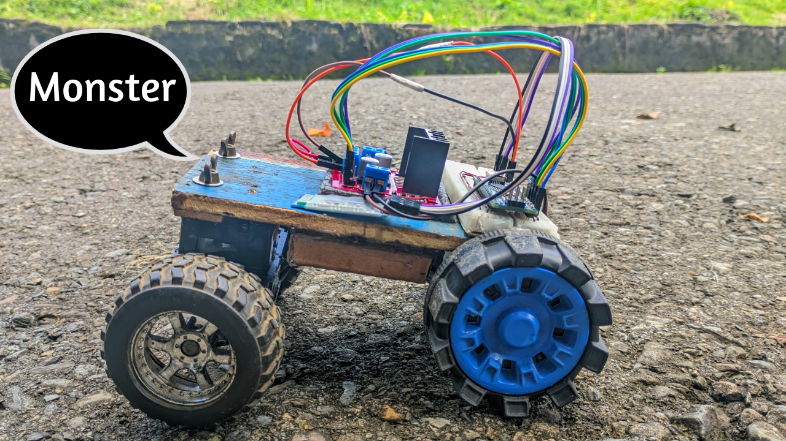
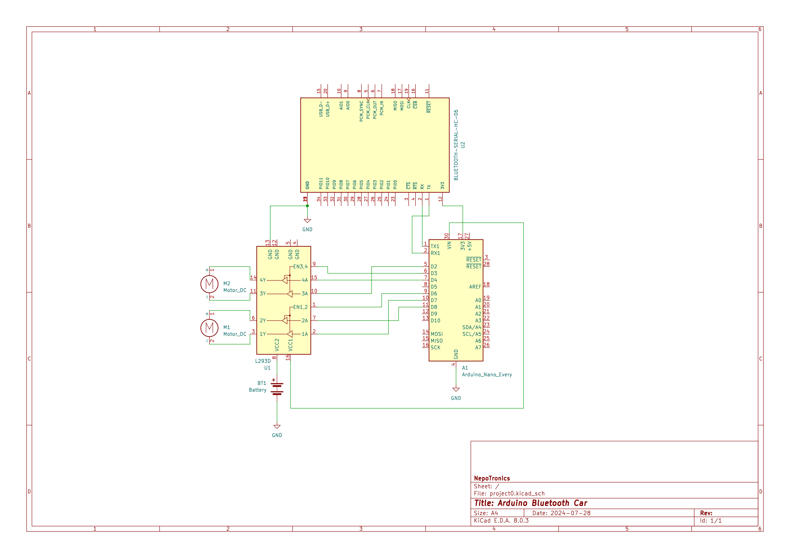
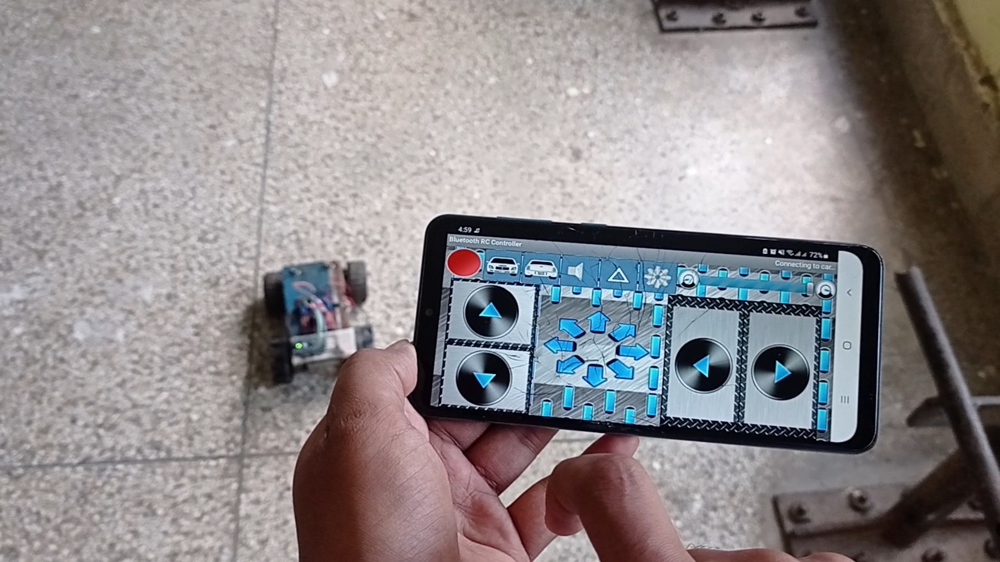
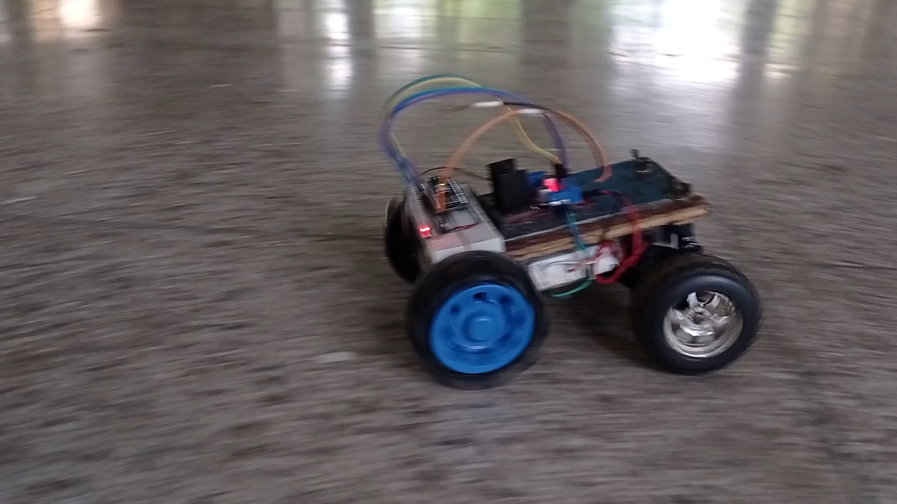

# 🚗 NepoTronics Bluetooth RC Car

<p align="center">
  
</p>

<p align="center">
  <strong>A sleek, responsive Bluetooth-controlled RC car built with Arduino</strong>
</p>

<p align="center">
  
  
  
  
  
</p>

---

## 📖 Table of Contents

- 📖 [Overview](#-overview)
- ✨ [Features](#-features)
- 🛠️ [Hardware Components](#️-hardware-components)
- 🔧 [Installation & Setup](#-installation--setup)
- 📁 [Project Structure](#-project-structure)
- 🔌 [Circuit Diagram](#-circuit-diagram)
- 💻 [Code Implementation](#-code-implementation)
- 📱 [Mobile App](#-mobile-app)
- 🎯 [Demo & Testing](#-demo--testing)
- 🤝 [Contributing](#-contributing)
- 📄 [License](#-license)
- 👨‍💻 [Author](#-author)

---

## 🎯 Overview

The **NepoTronics Bluetooth RC Car** is a professional-grade wireless robotic vehicle that demonstrates seamless integration of microcontroller programming, motor control systems, and Bluetooth communication. Designed and programmed by Sarpharaj Aalam, this project serves as an excellent learning platform for robotics enthusiasts, students, and DIY makers.

**What makes this project special:**
- 📡 Real-time wireless control via Bluetooth
- 🎓 Perfect educational resource for Arduino learners
- 🔧 Complete hardware and software documentation
- 🚀 Easy to build, customize, and extend

---

## ✨ Features

| Feature | Description |
|---------|-------------|
| 📱 **Wireless Control** | Real-time control via Bluetooth Android app |
| 🎮 **Multi-Directional** | Forward, backward, left, right, and diagonal movements |
| ⚡ **Smooth Control** | PWM-based speed control (0-255 levels) |
| 💡 **Smart Indicators** | LED headlights and brake lights |
| 🔋 **Portable** | Battery-powered for complete mobility |
| 🧩 **Modular** | Easy to modify and extend |

---

## 🛠️ Hardware Components

| Component | Quantity | Specification |
|-----------|----------|---------------|
| **Microcontroller** | 1× | Arduino Nano (ATmega328P) |
| **Motor Driver** | 1× | L298N Dual H-Bridge |
| **Bluetooth Module** | 1× | HC-05/HC-06 |
| **DC Motors** | 2× | Geared DC motors (For stering and rear drive) |
| **Wheels** | 4× | Standard robot wheels |
| **Battery** | 1× | 9V/12V Li-ion pack |
| **LEDs** | 4× | White (front) & Red (back) |
| **Chassis** | 1× | Acrylic/3D printed/Wooden frame|

<p align="center">
  
  
  
</p>

---

## 🔧 Installation & Setup

### Prerequisites

Before you begin, ensure you have the following installed:
- ✅ **VS Code** with PlatformIO extension
- ✅ **Arduino Nano** or compatible board
- ✅ **HC-05/HC-06** Bluetooth module
- ✅ **Android smartphone** with Bluetooth

### Step-by-Step Setup

#### 1. Clone the Repository

```bash
git clone https://github.com/sarpharaj-09/NepoTronics-RC-Car.git
cd NepoTronics-RC-Car
```

#### 2. Open in PlatformIO

- Launch **VS Code**
- Open **PlatformIO Home**
- Click **Open Project** → Select the cloned folder

#### 3. Configure Hardware

- Connect components as per circuit diagram
- Ensure proper power connections
- Double-check motor driver wiring

#### 4. Upload Code

- Connect Arduino via USB
- Click **Upload** in PlatformIO
- Monitor serial output at **9600 baud**

#### 5. Pair Bluetooth

- Power ON the circuit
- Phone: **Bluetooth settings** → Find "HC-05"
- Pair using PIN: **1234** or **0000**

---

## 📁 Project Structure

```
NepoTronics-RC-Car/
│
├── src/
│   └── main.cpp                 # Main application code
│
├── lib/                          # External libraries
│
├── include/                      # Header files
│
├── docs/
│   ├── circuit_diagram.jpg      # Wiring schematic
│   ├── app_ui.jpg               # Mobile app interface
│   ├── testing_video.mp4        # Demonstration video
│   ├── picture_inmotion.jpg     # Action photo
│   └── thumbnail.jpeg           # Project thumbnail
│
├── apk/
│   └── Bluetooth RC Controller.apk  # Control application
│
├── test/                         # Unit tests
│
├── platformio.ini                # Build configuration
├── LICENSE                       # MIT License
└── README.md                     # Project documentation
```

---

## 🔌 Circuit Diagram

<p align="center">
  
</p>

<p align="center">
  <strong>Complete wiring schematic for the RC car</strong>
</p>

### Pin Configuration

| Component | Arduino Pin | Function |
|-----------|-------------|----------|
| **Motor 1** | D6 (ENA), D7 (IN1), D8 (IN2) | Right motor control |
| **Motor 2** | D3 (ENB), D2 (IN3), D4 (IN4) | Left motor control |
| **Front LED** | D12 | Headlight control |
| **Back LED** | D11 | Brake light control |
| **Bluetooth** | D0 (RX), D1 (TX) | Serial communication |

> ⚠️ **Important:** Use voltage divider for HC-05 RX pin (3.3V logic)

---

## 💻 Code Implementation

### Key Functions

```cpp
// Motor control functions
void moveForward(int speed);
void moveBackward(int speed);
void turnLeft(int speed);
void turnRight(int speed);
void stopCar();

// Bluetooth command processing
void processBluetoothCommand(char command);
```

### Command Mapping

| Command | Action | Description |
|---------|--------|-------------|
| `F` | **Forward** | Move car forward |
| `B` | **Backward** | Move car backward |
| `L` | **Left** | Turn left |
| `R` | **Right** | Turn right |
| `S` | **Stop** | Stop all motors |
| `0-9` | **Speed** | Set speed level (0-255) |

### Sample Code Structure

```cpp
void setup() {
  Serial.begin(9600);      // Bluetooth communication
  pinMode(ENA, OUTPUT);    // Motor enable pins
  pinMode(IN1, OUTPUT);    // Motor direction
  // ... initialization code
}

void loop() {
  if (Serial.available() > 0) {
    char command = Serial.read();
    processBluetoothCommand(command);
  }
}
```

---

## 📱 Mobile App

<p align="center">
  
</p>

<p align="center">
  <strong>User-friendly control interface</strong>
</p>

### Download & Installation

#### 📥 **Download APK:**

- [Bluetooth RC Controller.apk](apk/Bluetooth%20RC%20Controller.apk)
- Right-click → Save link as... if direct download fails

#### 🔧 **Installation:**

1. Enable "Install from unknown sources" in Android settings
2. Locate downloaded APK file
3. Follow installation prompts

#### 🎮 **Connection:**

1. Open app → Enable Bluetooth
2. Select "HC-05" from devices list
3. Use directional pad to control car

<p align="center">
  <a href="apk/Bluetooth%20RC%20Controller.apk">
    
  </a>
</p>

---

## 🎯 Demo & Testing

### Live Demonstration

<p align="center">
  
</p>

<p align="center">
  <strong>RC car performing maneuvers</strong>
</p>

### 🎥 Video Resources

<p align="center">
  <a href="docs/testing_video.mp4"><strong>📂 Testing Video</strong></a> &mdash; Basic functionality demo (local file)
</p>

<p align="center">
  <strong>▶️ YouTube Demo:</strong><br>
  <a href="https://youtu.be/lI9yIjI4Ih8?si=d67M4r0bCj9dotXv">
    
  </a>
</p>

### Performance Results

| Metric | Result |
|--------|--------|
| ✅ Response Time | Instant command execution |
| ✅ Connection Range | Up to 15 meters |
| ✅ Control Smoothness | PWM-based smooth operation |
| ✅ Reliability | Stable across multiple sessions |

---

## 🤝 Contributing

We welcome contributions! Here's how you can help:

1. **Fork** the repository
2. **Create** a feature branch (`git checkout -b feature/AmazingFeature`)
3. **Commit** your changes (`git commit -m 'Add AmazingFeature'`)
4. **Push** to the branch (`git push origin feature/AmazingFeature`)
5. **Open** a Pull Request

### Areas for Improvement

- [ ] ESP32 migration with WiFi control
- [ ] Obstacle avoidance sensors
- [ ] Camera integration for FPV
- [ ] Mobile app enhancements
- [ ] iOS app development
- [ ] Speed optimization algorithms

---

## 📄 License

This project is licensed under the **MIT License** - see the [LICENSE](LICENSE) file for details.

```
MIT License

Copyright (c) 2024 Sarpharaj Aalam

Permission is hereby granted, free of charge, to any person obtaining a copy
of this software and associated documentation files...
```

---

## 👨‍💻 Author

<p align="center">
  <strong>Sarpharaj Aalam</strong><br>
  💼 Project Developer & Robotics Enthusiast
</p>

<p align="center">
  <a href="https://web.facebook.com/Nepotronics">
    
  </a>
  <a href="https://www.instagram.com/sarpharaj_09/">
    
  </a>
  <a href="https://www.youtube.com/@nepotronics">
    
  </a>
</p>

<p align="center">
  🌐 <strong>Channel:</strong> <a href="https://www.youtube.com/@nepotronics">NepoTronics</a><br>
  🔗 <strong>Connect:</strong>
  <a href="https://web.facebook.com/Nepotronics">Facebook</a> •
  <a href="https://www.instagram.com/sarpharaj_09/">Instagram</a>
</p>

---

## ⭐ Support the Project

<p align="center">
  If this project helped you learn or inspired your own creations,<br>
  please give it a <strong>star</strong> on GitHub!
</p>

<p align="center">
  <a href="https://github.com/sarpharaj-09/NepoTronics-RC-Car/stargazers">
    
  </a>
  <a href="https://github.com/sarpharaj-09/NepoTronics-RC-Car/network/members">
    
  </a>
</p>

---

<p align="center">
  <i>"Every small circuit is a big step toward innovation."</i><br>
  <strong>- Sarpharaj Aalam</strong>
</p>

---

<p align="center">
  Made with ❤️ by <strong>NepoTronics</strong><br>
  <sub>Last updated: October 2025</sub>
</p>
